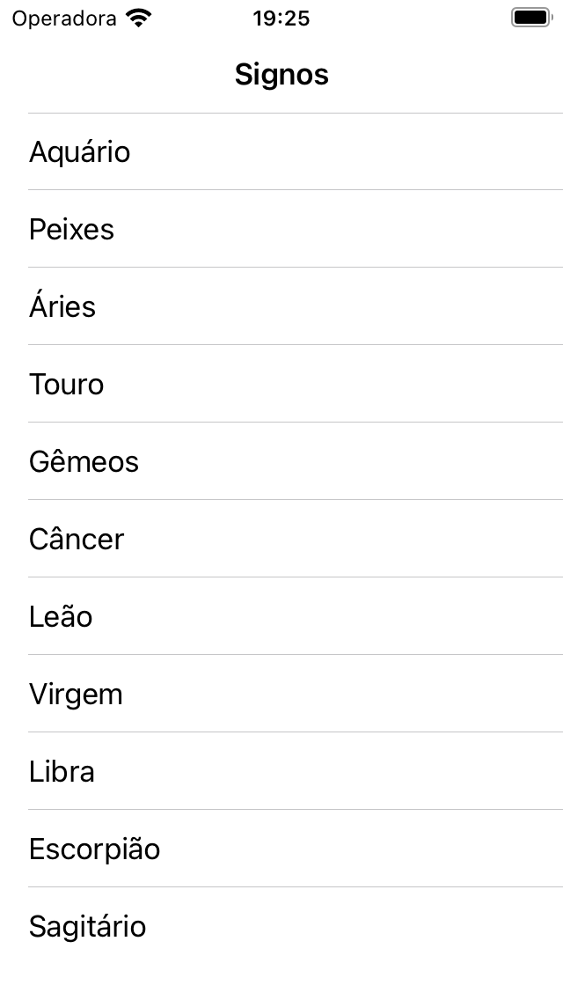
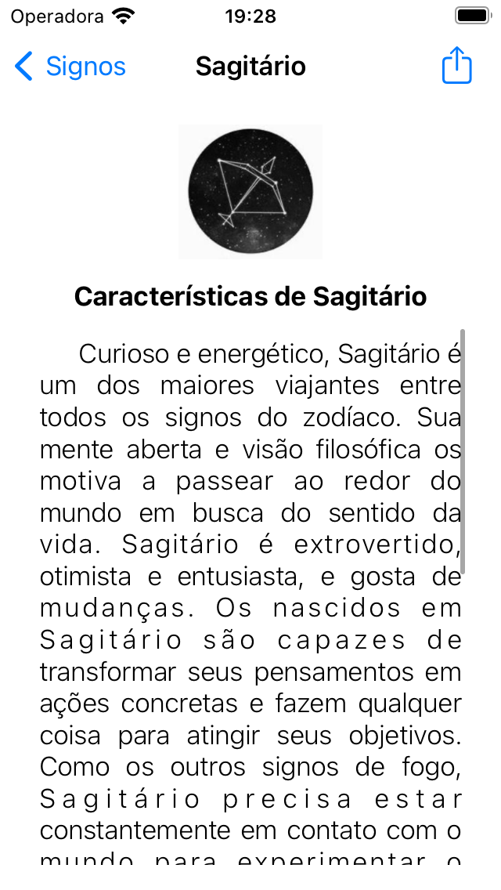

# Signos App IOS :iphone:

## :pushpin: Introdução
Aplicativo sobre todos os signos do zodíaco.

### :memo: Descrição
Meu primeiro projeto em iOS foi um aplicativo que lista as características de cada signo do zodíaco, o app apresenta informações precisas e detalhadas sobre cada signo. Para desenvolver o aplicativo, usei a linguagem de programação Swift e a biblioteca UIKit. Os dados foram mockados diretamente no projeto, criando uma estrutura interna para armazenar as informações sobre cada signo. O design do aplicativo foi pensado para proporcionar uma experiência clean e simples. O aplicativo também permite que os usuários compartilhem as características sobre os signos para seus amigos. Desenvolver esse projeto  foi uma experiência enriquecedora que me proporcionou o início da minha carreira como desenvolvedora iOS.

Exemplo:

             
